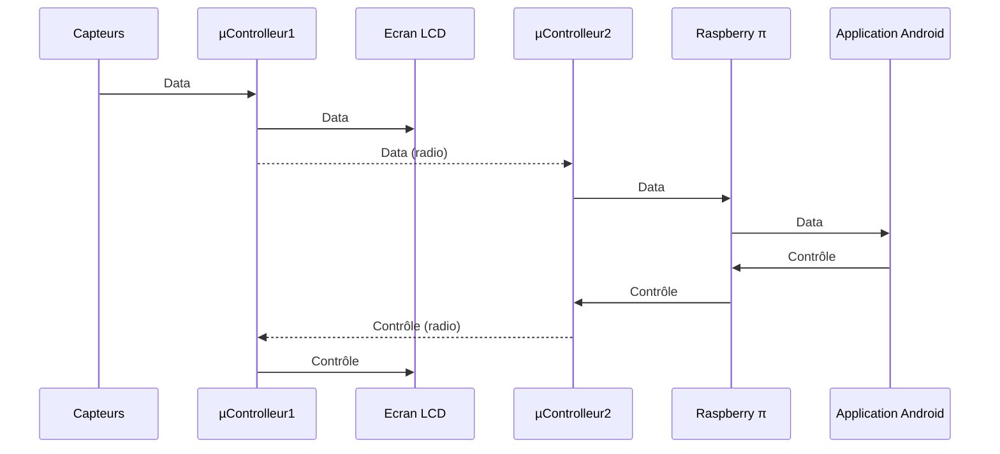

# Mini-Projet IoT

### Introduction

Ce mini-projet nous a été proposé dans le cadre du module **Architecture et protocoles réseaux pour IoT**. Il consiste a piloter dynamiquement l'affichage d'un écran LCD (relié à un µ-contrôleur) grâce à une application mobile android. L'architecture du système est résumé dans le schéma ci-dessous.

Des capteurs d'humidité, de température et de luminosité sont relié à un µ-contrôleur. Celui-ci récupère ces données et les affiche sur l'écran LCD. Les données sont aussi envoyées à l'application mobile. Sur cette application, on peut choisir l'ordre d'affichage des données sur l'écran LCD.

### µ-Contrôleur & Capteurs

Les 3 capteurs communiquent avec le µ-contrôleur grâce au bus I2C. Ce µ-contrôleur reçoit les données et les communique sur une liaison radio à un autre contrôleur identique.

##### Réception du bus I2C

##### Envoi sur liaison radio

### Passerelle

C'est le deuxième µ-contrôleur qui sert de passerelle avec la raspberry π . Il traite les données reçues sur la liaison radio afin de les envoyer à la raspberry π et s'occupe de fonctionnalités comme le chiffrement.

##### Chiffrement

##### Réception sur la liaison radio

##### Envoi à la Raspberry π

### Raspberry π 

La Raspberry π nous sert de serveur applicatif, puisqu'il enregistre les données et embarque notamment Grafana afin de générer des vues de ses donnés. Il communique aussi avec l'application Android pour lui envoyé des données et recevoir des ordres.

##### Enregistrement des données

##### Serveur Grafana

### Application Mobile

### Retour d'expérience

### Conclusion
